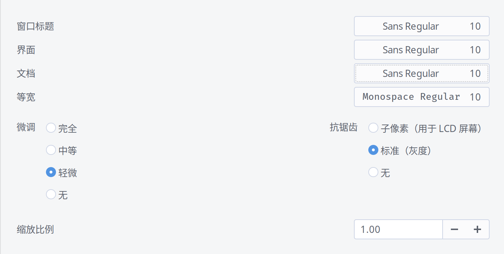
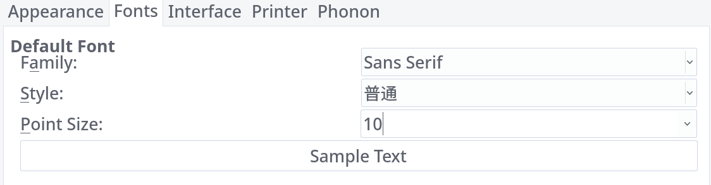

# fontconfig-zh-cn

## 📖[使用说明](https://github.com/rabbee/fontconfig-zh-cn)

### For Archlinux

#### 安装字体

- Noto全系字体


```bash
sudo pacman -S noto-fonts noto-fonts-cjk noto-fonts-emoji
```

- Fira Code

```bash
sudo pacman -S otf-fira-code otf-fira-mono
```

- 放置配置文件

```bash
cd fontconfig-zh-cn
sudo cp fonts.conf /etc/fonts/conf.avail/99-"yourname".conf
sudo ln -sf /etc/fonts/conf.avail/99-yourname.conf /etc/fonts/conf.d/
 ```

- 刷新字体缓存

```bash
fc-cache --force -v
```

#### Gnome

- gnome-tweak-tool设置



- qtconfig-qt4设置

